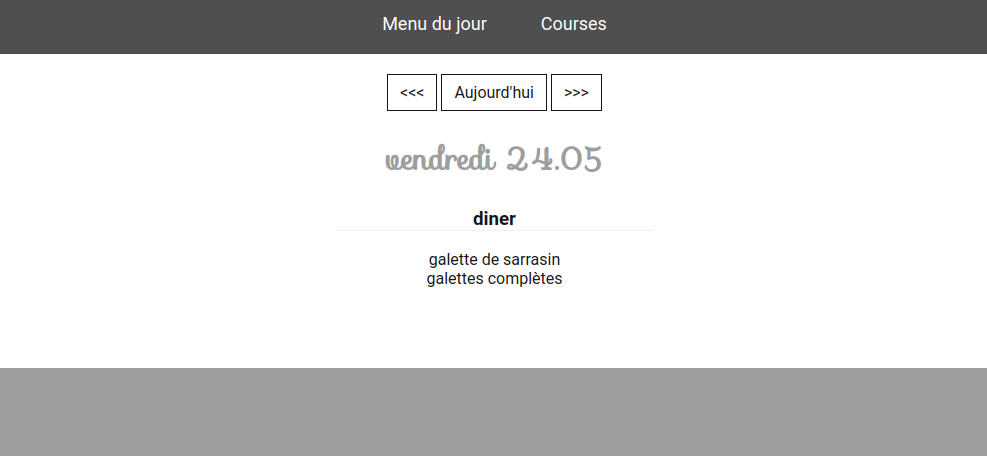

# Présentation de la version 1

## partie publique

### le menu

L'application est disponible à l'adresse http://cuisine.karned.bzh/  

En arrivant sur l'app, on se retrouve sur le menu du jour. Il y a également un menu pour se rendre à la liste des courses qui sera détaillée plus bas. Il y a aussi une naviguation dans la semaine pour consulter le menu des jours passés et suivants. 

Les boutons de naviguation permettent d'accéder aux autres jours de la semaine. 

A partir du menu, il est possible d'accéder à la fiche recette. Cette fiche affiche les proportions des ingrédients nécessaire en fonction du nombre de part à préparer. 

### les courses

Il est possible de consulter les dernières listes de courses à faire. 

Puis en cliquant sur une liste, d'en voir le détail ventilé par commerçant.

