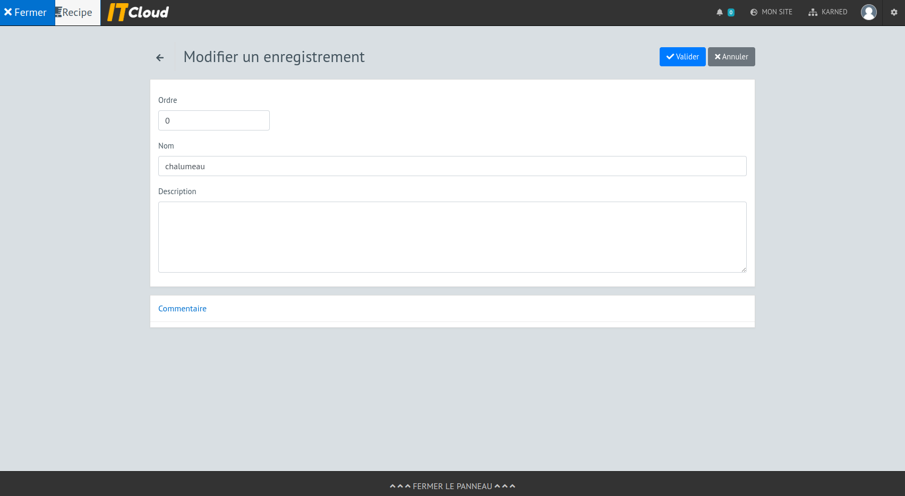
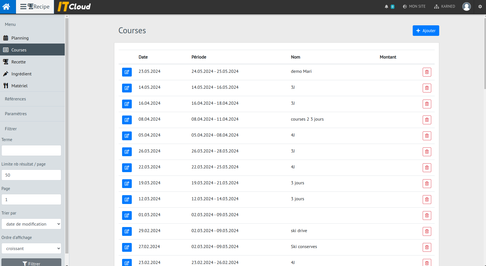

# Présentation de la version 1

## partie publique

### le menu

L'application est disponible à l'adresse http://cuisine.karned.bzh/  

En arrivant sur l'app, on se retrouve sur le menu du jour. Il y a également un menu pour se rendre à la liste des courses qui sera détaillée plus bas. Il y a aussi une naviguation dans la semaine pour consulter le menu des jours passés et suivants. 

Les boutons de naviguation permettent d'accéder aux autres jours de la semaine. 

A partir du menu, il est possible d'accéder à la fiche recette. Cette fiche affiche les proportions des ingrédients nécessaire en fonction du nombre de part à préparer. 

### les courses

Il est possible de consulter les dernières listes de courses à faire. 

Puis en cliquant sur une liste, d'en voir le détail ventilé par commerçant.

## partie privée

L'accueil de la partie privée est la suivante  

### matériel

Permet de lister le matériel à disposition. Il pourra être indiqué dans les recettes des besoins en matériel particulier. Par exemple : un appareil à raclette  

Et voici la fiche

## ingrédient

Permet de lister les ingrédients qui pourront ensuite être utilisés dans les recettes.

Et la fiche détaillée. Nous y retrouvons des informations sur le rayon dans lequel le trouvé, le groupe de produit auquel il appartient, le fournisseur chez qui l'acheter et une indication sur la saisonnalité.

## recette

Liste des recettes.

La fiche détaillée d'une recette comprend la liste du matériel nécessaire, la liste des ingrédients et les quantités, les étapes de la préparation, des informations de classification et de quantité ou nombre de parts.

la vue modification (sur une recette moins remplie)

## courses 

liste des courses à faire pour une période donnée.

Le détail de la liste des courses. On peut y ajouter des ingrédients, ils sont triés par commerçants. Il est possible de générer la liste qui prendra la période à convrir et regardera toutes les recettes à préparer et le nombre de convives par recette afin d'établir la liste précise. Les ingrédients se regroupant évidemment pour se cumuler.

## planning

Le planning global permet de déterminer quelle recette sera à péparer pour combien de personne et quel repas dans la journée.

Le formulaire d'ajout d'une recette au planning.

